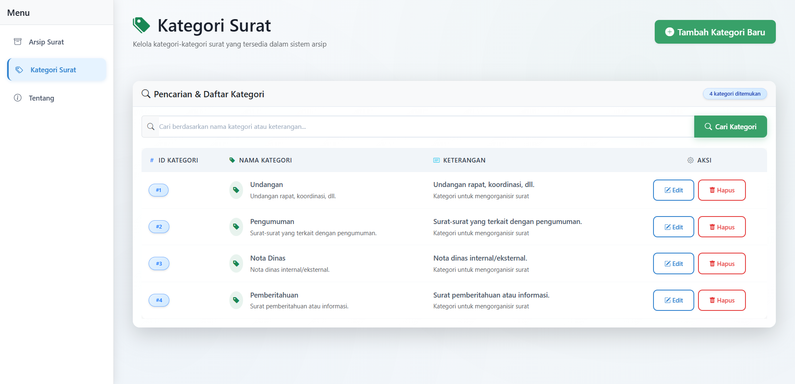

# DriveSurat - Sistem Arsip Surat Kelurahan Karangduren

[](https://laravel.com)
[](https://php.net)
[](https://mysql.com)
[](https://getbootstrap.com)
[](LICENSE)

Sistem arsip surat modern berbasis web yang dibangun dengan Laravel 12.x. Aplikasi ini menyediakan solusi lengkap untuk manajemen arsip surat dengan fitur upload PDF, pencarian, dan dashboard interaktif.

## ✨ Fitur Utama

### 📄 Manajemen Surat

-   ✅ CRUD lengkap (Create, Read, Update, Delete)
-   ✅ Upload file PDF dengan validasi
-   ✅ Preview surat langsung di browser
-   ✅ Kategorisasi surat berdasarkan jenis
-   ✅ Pencarian berdasarkan nomor surat

### 🎨 Antarmuka Modern

-   ✅ Responsive design dengan Bootstrap 5.3.3
-   ✅ UI modern dengan efek glassmorphism
-   ✅ Animasi dan transisi smooth

### 🔒 Validasi

-   ✅ Input validation
-   ✅ File upload security (PDF only, size limit)

### 📊 Dashboard & Analytics

-   ✅ Statistik surat per kategori
-   ✅ Aktivitas terbaru
-   ✅ Overview data arsip
-   ✅ Export data ke berbagai format

## 🚀 Quick Start

### Persyaratan Sistem

-   PHP 8.1 atau lebih tinggi
-   Composer
-   Node.js & NPM
-   MySQL 8.0+
-   Git

### Instalasi Manual

1. **Clone Repository**

    ```bash
    git clone https://github.com/rafaxputra/drivesurat.git
    cd drivesurat
    ```

2. **Install Dependencies**

    ```bash
    composer install
    npm install
    ```

3. **Konfigurasi Environment**

    ```bash
    cp .env.example .env
    php artisan key:generate
    ```

4. **Setup Database**

    ```bash
    # Edit .env file dengan kredensial database Anda
    php artisan migrate
    php artisan db:seed
    ```

5. **Build Assets & Jalankan**

    ```bash
    npm run dev
    php artisan serve
    ```

    Akses aplikasi di: http://localhost:8000

## 📁 Struktur Proyek

```
drivesurat/
├── app/                    # Logika aplikasi
│   ├── Http/Controllers/   # Controllers
│   └── Models/            # Eloquent models
├── database/
│   ├── migrations/        # Database migrations
│   └── seeders/          # Database seeders
├── public/               # Public assets
├── resources/
│   ├── css/             # Stylesheets
│   ├── js/              # JavaScript files
│   └── views/           # Blade templates
├── routes/              # Route definitions
├── storage/             # File storage
├── tests/              # PHPUnit tests
```

## 🛠️ Teknologi yang Digunakan

-   **Backend**: Laravel 12.x, PHP 8.1+
-   **Frontend**: Bootstrap 5.3.3, Custom CSS, JavaScript
-   **Database**: MySQL 8.0+
-   **Asset Management**: Vite, NPM
-   **Deployment**: Manual deployment

## 📖 Penggunaan

### Menambah Surat Baru

1. Login ke aplikasi
2. Klik menu "Surat" → "Tambah Surat"
3. Isi form dengan data surat
4. Upload file PDF
5. Pilih kategori
6. Simpan

### Mencari Surat

-   Gunakan search box di halaman surat
-   Cari berdasarkan nomor surat
-   Hasil akan ditampilkan secara real-time

### Mengelola Kategori

-   Akses menu "Kategori"
-   Tambah, edit, atau hapus kategori
-   Kategori akan memudahkan organisasi surat

## 📸 Screenshot Aplikasi

### Halaman Daftar Surat


_Halaman daftar semua surat dengan fitur pencarian_

### Form Tambah Surat


_Form untuk menambahkan surat baru dengan upload file PDF_

### Form Edit Surat


_Form untuk mengedit data surat yang sudah ada_

### Preview Surat PDF


_Preview surat PDF langsung di browser_

### Modal Hapus Surat


_Modal konfirmasi hapus surat_

### Halaman Kategori


_Halaman untuk mengelola kategori surat_

### Form Tambah Surat


_Halaman untuk menambah kategori surat_

### Form Tambah Surat


_Halaman untuk mengedit kategori surat_

### Modal Hapus Kategori


_Modal konfirmasi hapus kategori_

### Halaman About/Developer


_Halaman informasi developer dan tanggal pembuatan proyek_

## 📦 Deployment

Untuk production, pastikan:

-   `APP_ENV=production`
-   `APP_DEBUG=false`
-   `APP_URL=https://yourdomain.com`
-   Database credentials sudah dikonfigurasi

## 🤝 Berkontribusi

Kami menerima kontribusi dari komunitas! Lihat [CONTRIBUTING.md](CONTRIBUTING.md) untuk panduan berkontribusi.

### Development Workflow

1. Fork repository
2. Buat branch fitur: `git checkout -b feature/NamaFitur`
3. Commit perubahan: `git commit -m 'feat: menambah fitur X'`
4. Push ke branch: `git push origin feature/NamaFitur`
5. Buat Pull Request

## 📝 Changelog

Lihat [CHANGELOG.md](CHANGELOG.md) untuk riwayat perubahan.

## 📄 Lisensi

Proyek ini dilisensikan di bawah [MIT License](LICENSE).

## 👨‍💻 Developer

**Nama**: Pandya Rafa Haibah Putra
**NIM**: 2331730061
**Program Studi**: Manajemen Informatika
**Institusi**: Politeknik Negeri Malang

---

**Catatan**: Proyek ini dibuat sebagai bagian dari submission tugas LSP.

⭐ Jika proyek ini bermanfaat, jangan lupa untuk memberikan star!
